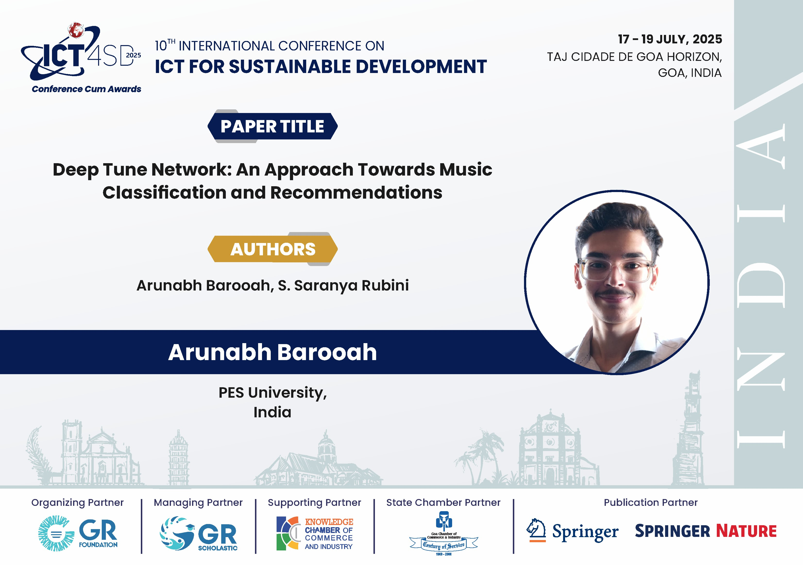
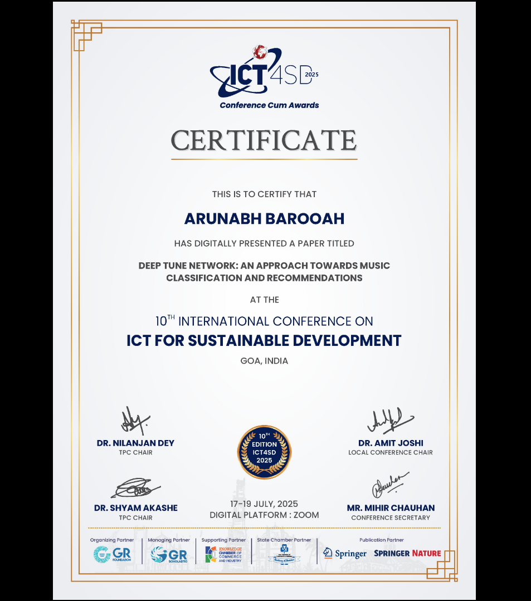
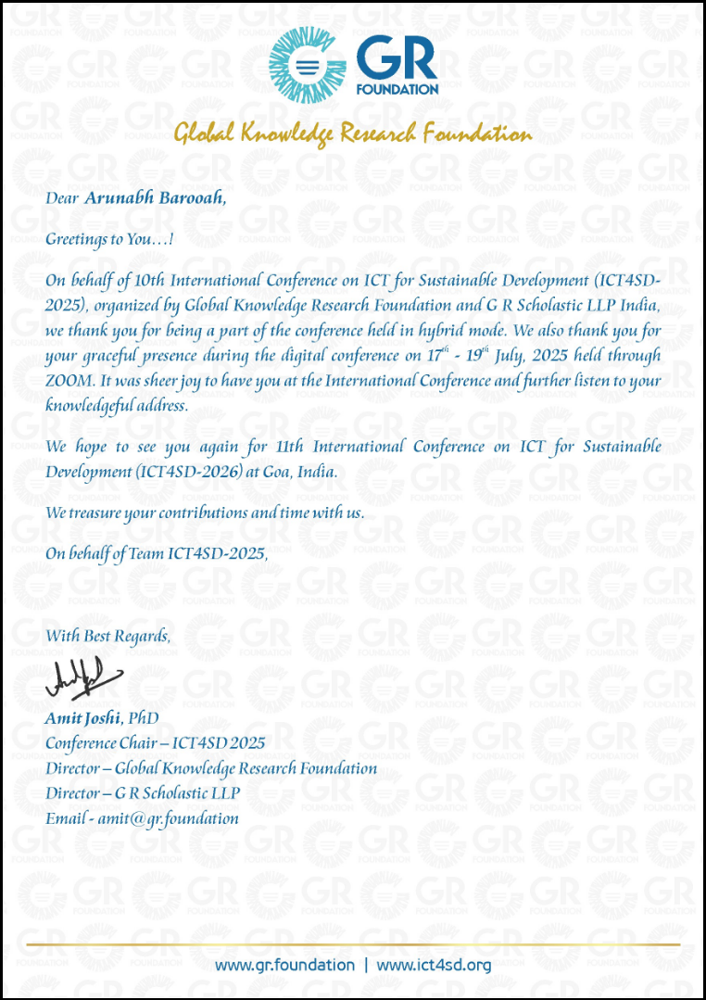

<!-- Link to icon animation CSS -->
<link rel="stylesheet" href="assets/css/icon-animations.css">
<!-- Link to About/Skills styling CSS -->
<link rel="stylesheet" href="assets/css/about-skills.css">
<!-- Link to Resume Button styling CSS -->
<link rel="stylesheet" href="assets/css/resume-btn.css">

<!-- Hero Section -->
<section id="hello" class="content-section">
  

    <h1 class="hero-title">Hi, I'm ARUNABH BAROOAH</h1>
    
I build things at the intersection of software, data, and design.

  

</section>

<!-- About / Skills / Links Bento -->
<section id="about" class="content-section">
  

    

      <h2>About Me</h2>
      
 CSE undergraduate at PES University with a passion for  full-stack development, data engineering, and machine learning. 
      I love building fast, innovative, useful, and beautiful products.

    

    

      <h2>Skills</h2>
      <ul>
        <li><b>Programming Languages:</b> C, C++, Python, Go, JavaScript, HTML, CSS</li>
        <li><b>Web Development:</b> MongoDB, Express, ReactJS, NodeJS, NextJS, MySQL</li>
        <li><b>Big Data:</b> Kafka, Spark, Hadoop</li>
        <li><b>Design Tools: </b> Figma, Krita, Blender, Canva</li>
      </ul>
    

    

      <h2>Links</h2>
      
      
      
      <a href="assets/file/arunabh_barooah_resume.pdf" download class="resume-download-btn">Download Resume</a>
    

  

</section>

<!-- Projects -->
<section id="projects" class="content-section">
  

    <h2 class="section-heading">My Projects</h2>
    

      <a class="project-card project-link" href="https://github.com/Arunabh13prt/Distributed-Logging-System" target="_blank">
        <h3>Distributed logging system for Microservices</h3>
        
A system where multiple microservices can send messages over a pub-sub model. Built with Spark, Kafka, Fluentd, Kibana, ElasticSearch.

      </a>
      <a class="project-card project-link" href="https://github.com/aryanmishra333/LAMBDA-Serverless-Function-Platform" target="_blank">
        <h3>⚙️ Serverless Execution Engine</h3>
        
A serverless function platform that allows you to run Python and Node.js code in isolated containers, similar to AWS Lambda. Built with Docker, gVisor, FastAPI

      </a>
      <a class="project-card project-link" href="https://github.com/Arunabh13prt/Music-Genre-Classification-and-Recommendation-System" target="_blank">
        <h3>Deep Tune Network</h3>
        
A Music Genre Classification System and Recommendation System using ML models like CNN, RNN-LSTM, kNN, and techniques like cosine similarity. 
        Published in Springer Nature.

      </a>
      <a class="project-card project-link" href="#" target="_blank">
        <h3>🛠️ Portfolio Site</h3>
        
This website! Built with Jekyll and GitHub Pages to showcase my projects and writing.

      </a>
    

  

</section>

<!-- Experience -->
<section id="experience" class="content-section">
  

    <h2 class="section-heading">Experience</h2>
    

      

        

        

          <h3>ML Research Intern @ C3I, PES University</h3>
          
June 2024 – July 2024

          
Developed Deep Tune Network (DTN) using Convolutional Neural Networks and MFCCs for automatic music genre classification,
achieving 93.01% test accuracy on the GTZAN dataset and designed a cosine similarity-based recommendation system with a similarity score of 0.85.

        

      

      

        

        

          <h3>Core Member @ Parallax PESU</h3>
          
Sept 2023 – Present

          
Delivered a workshop on Krita to 40-50 students, achieving a 90% satisfaction rate based on post-workshop survey. Also executed marketing campaigns resulting in 500+ workshop registrations and 10,000+ social media interactions.

        

      

      

        

        

          <h3>Member @ CodeChef PESU ECC</h3>
          
Nov 2023 – Jan 2025

          
Part of the design team. Designed and delivered marketing materials for the CodeChef PESU ECC events.

        

      

      <!-- Add more timeline-item blocks as needed -->
    

  

</section>

<!-- Certificates -->
<section id="certificates" class="content-section">
  

    <h2 class="section-heading">Certificates</h2>
    

      
      
      
      <!-- Add more certificate <a> blocks as needed -->
    

  

</section>

